# Cambridge Solidarity Fund — Grant Lottery System

**Proposal for volunteer approval — March 2026**

## Summary

We're moving from manually awarding £40 grants to a **lottery-based system**: anyone applies during a limited window, winners are randomly drawn at month end, limited by available Open Collective funds.

---

## How It Works

```mermaid
flowchart TD
    subgraph "📥 APPLICATION PHASE · open for a limited window (dates TBD)"
        SMS([📱 Person texts or<br/>emails to apply]) --> LINK[Auto-reply with<br/>unique form link]
        WEB([🌐 Person visits<br/>website form]) --> FORM
        LINK --> FORM["Complete Online Form<br/>(name, phone number (required),<br/>email (optional),<br/>meeting place or address,<br/>payment preference: bank or cash)"]

        FORM --> ID{Identity<br/>Resolution}
        ID -->|Phone + name match| EXISTING[Link to existing<br/>applicant profile]
        ID -->|Known phone,<br/>different name| FLAG["📧 Auto-notify:<br/>'A volunteer will<br/>contact you shortly'"]
        ID -->|No match| NEW[Create new<br/>applicant profile]

        EXISTING --> ELIG
        FLAG -->|Volunteer contacts<br/>& confirms identity| ELIG
        NEW --> ELIG

        ELIG{Eligibility<br/>Check}
        ELIG -->|Last grant < 3 months| REJ_COOL[❌ Rejected<br/>Too soon — notify]
        ELIG -->|Already applied<br/>this month| REJ_DUP[❌ Rejected<br/>Duplicate — notify]
        ELIG -->|✅ Eligible| POOL[✅ Added to<br/>Lottery Pool]
    end

    subgraph "🎲 LOTTERY PHASE · Month End"
        TIMER([⏰ Month-end<br/>scheduler fires]) --> CLOSE[Close application<br/>window]
        CLOSE --> BALANCE[Query Open Collective<br/>for fund balance]
        BALANCE --> CALC["Calculate slots:<br/>floor((balance − reserve) ÷ £40)"]
        CALC --> DRAW[🎲 Draw lottery<br/>with auditable RNG seed]

        DRAW --> WINNERS[🏆 Selected winners<br/>in ranked order]
        DRAW --> LOSERS[Not selected]

        WINNERS --> WIN_NOTIFY[📧 Notify winners<br/>via email/SMS]
        LOSERS --> LOSE_NOTIFY[📧 Notify non-winners<br/>via email/SMS]
    end

    subgraph "💳 PAYMENT PHASE"
        WIN_NOTIFY -->|Chose bank transfer| BANK_FORM["📧 Auto-send secure form:<br/>• Upload proof of address<br/>• Enter bank details<br/>(sort code + account no.)"]
        WIN_NOTIFY -->|Chose cash| CASH_MEET["Volunteer contacts<br/>recipient to arrange<br/>cash handover"]

        BANK_FORM --> UPLOAD([Recipient submits<br/>POA + bank details])
        UPLOAD --> VERIFY{Volunteer<br/>verifies POA}
        VERIFY -->|✅ Approved| CLEARED[Due diligence<br/>passed]
        VERIFY -->|❌ Rejected| RETRY{Attempts<br/>< 3?}
        RETRY -->|Yes| BANK_FORM
        RETRY -->|No| OFFER_CASH{"Offer cash<br/>instead?"}
        OFFER_CASH -->|Accepts| CASH_MEET
        OFFER_CASH -->|Declines| RELEASE[Slot released<br/>to waitlist]

        CASH_MEET --> CASH_DONE([Cash handed<br/>over in person])
        CASH_DONE --> RECORD

        CLEARED --> RECHECK[Re-check fund<br/>balance]
        RECHECK -->|Sufficient ✅| PAY["💸 Pay £40<br/>(transfer or cash)"]
        RECHECK -->|Insufficient ❌| PAUSE[⚠️ Paused<br/>Alert volunteers]

        PAY --> RECORD[✅ Grant recorded<br/>3-month cooldown starts]
    end

    subgraph "⏳ NO-RESPONSE HANDLING"
        WIN_NOTIFY -->|No response<br/>7 days| REMIND["Send reminder<br/>+ try calling if<br/>phone number on file"]
        REMIND -->|No response<br/>14 days| HOLD[Slot held until<br/>month end]
        HOLD -->|Month end| RELEASE
    end

    subgraph "📋 WAITLIST"
        RELEASE --> WAIT{Next person<br/>on waitlist?}
        WAIT -->|Yes| WIN_NOTIFY
        WAIT -->|No| ROLLOVER[Funds roll over<br/>to next month]
    end

    POOL -.->|End of month| TIMER

    style SMS fill:#4CAF50,color:#fff
    style WEB fill:#4CAF50,color:#fff
    style REJ_COOL fill:#f44336,color:#fff
    style REJ_DUP fill:#f44336,color:#fff
    style POOL fill:#2196F3,color:#fff
    style DRAW fill:#9C27B0,color:#fff
    style RECORD fill:#4CAF50,color:#fff
    style PAY fill:#FF9800,color:#fff
    style PAUSE fill:#f44336,color:#fff
```

---

## Key Rules

| Rule | Detail |
|------|--------|
| **Grant amount** | £40 fixed |
| **Cooldown** | 3 months from selection month (selected Jan → reapply Apr) |
| **Application window** | Limited window each month (dates TBD — not open all month) |
| **Phone number** | Mandatory — helps with eligibility checking and contacting winners |
| **How many winners?** | Based on available funds: (balance − reserve) ÷ £40, reserve set by admin |
| **Unresponsive winners** | Reminder + phone call attempt at 7 days, slot held until month end then released to waitlist |
| **Proof of address** | Required for bank transfer, max 3 attempts — then offered cash as alternative |
| **Payment options** | Bank transfer or cash (in-person handover) |
| **Data retention** | Applicant info auto-deleted after 6 months (matching existing volunteer data policy) |

---

## What's Automated vs. What Volunteers Do

### The system handles
- Auto-reply to SMS/email with application form link
- Checking eligibility (cooldown period, duplicate applications)
- Running the lottery draw at month end
- Notifying winners and non-winners
- Sending bank details + proof of address forms to winners
- Sending reminders to unresponsive winners
- Moving waitlisted people up when a slot opens

### Volunteers need to
- Check identity when a known phone number applies with a different name
- Review proof of address uploads (for bank transfers)
- Meet recipients in person to hand over cash
- Handle any paused payments (e.g. if funds run low mid-cycle)

---

## How Someone Applies

1. Text/email us, or visit the website
2. Get a link to the online form
3. Fill in: name, phone number (required), email (optional), where they'd like to meet (or address), and whether they want bank transfer or cash
4. If eligible, they're added to that month's lottery pool
5. At month end, winners are drawn and notified

## What Happens If You Win

**Bank transfer:**
1. You receive a secure form to upload proof of address and enter bank details
2. A volunteer checks the proof of address (up to 3 attempts)
3. If proof of address can't be verified, you'll be offered cash instead
4. £40 is transferred to your account (or handed over as cash)

**Cash:**
1. A volunteer contacts you to arrange a meeting
2. They hand over £40 in person

## What Happens If You Don't Win

- You're notified that you weren't selected this month
- You can apply again next month
- If a winner doesn't respond within 14 days (we'll try calling too), their slot is released to the waitlist at month end

---

*Please leave comments with any questions, concerns, or suggestions!*
