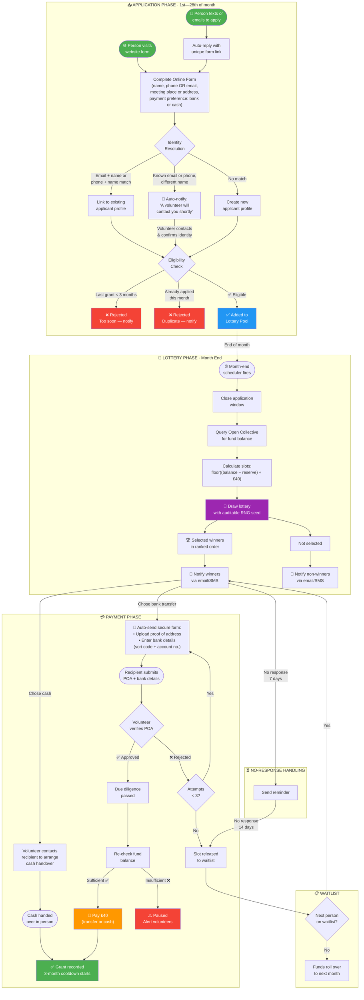
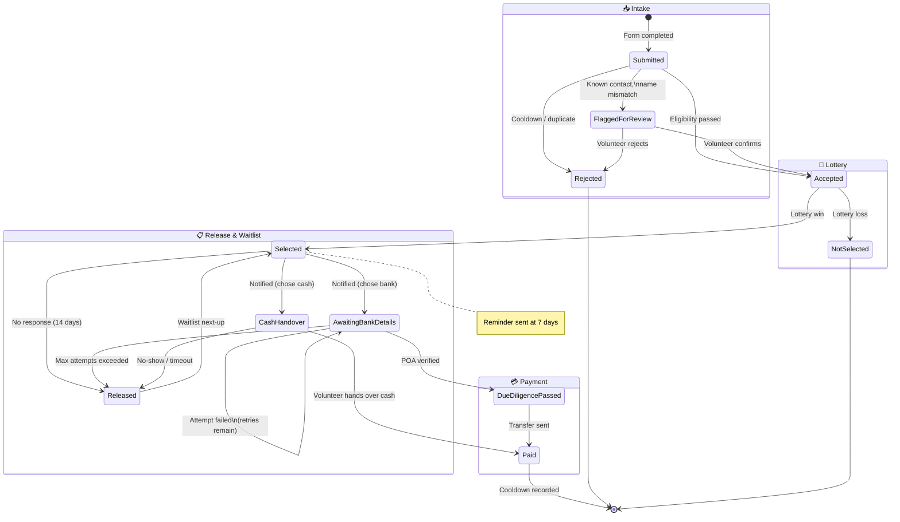

# Cambridge Solidarity Fund — Grant Lottery System

**Proposal for volunteer approval — March 2026**

## Summary

We're moving from manually awarding £40 grants to a **lottery-based system**: anyone applies during the month, winners are randomly drawn at month end, limited by available Open Collective funds.

---

## Full Workflow

---

## Application State Machine

---

## Key Rules

| Rule | Detail |
|------|--------|
| **Grant amount** | £40 fixed |
| **Cooldown** | 3 months from selection month (selected Jan → reapply Apr) |
| **Application window** | 1st–28th of each month |
| **Slots available** | `floor((balance − reserve) ÷ £40)`, reserve set by admin |
| **Unresponsive winners** | Reminder at 7 days, released to waitlist at 14 days |
| **POA verification** | Max 3 attempts, then slot released to waitlist |
| **Payment options** | Bank transfer or cash (in-person meeting) |

---

## Automated vs. Volunteer Actions

### Automated
- Auto-reply to SMS/email with form link
- Eligibility checks (cooldown, duplicates)
- Lottery draw (auditable random seed)
- Winner/non-winner notifications
- Bank details + POA form delivery
- Reminders for unresponsive winners
- Waitlist promotion

### Volunteer Actions
- Resolve identity mismatches (known contact, different name)
- Verify proof of address uploads
- Contact recipients and hand over cash
- Handle edge cases / paused payments

---

## Domain Events

| Event | Trigger | What Happens |
|-------|---------|--------------|
| `FormLinkRequested` | SMS/email received | Auto-reply with unique pre-filled form URL |
| `ApplicationSubmitted` | Form completed | Resolve identity → Check eligibility |
| `IdentityFlagged` | Known email or phone, different name | Auto-notify applicant; add to volunteer queue |
| `IdentityConfirmed` | Volunteer confirms flagged applicant | Proceed to eligibility check |
| `ApplicationAccepted` | Eligibility passed | Add to lottery pool |
| `ApplicationRejected` | Cooldown/duplicate/ineligible | Notify applicant with reason |
| `ApplicationWindowClosed` | Scheduler (month end) | Query OC balance → Calculate slots → Draw lottery |
| `LotteryDrawn` | RNG draw complete | Notify winners (bank: send POA form, cash: notify volunteer) + notify non-winners |
| `BankDetailsSubmitted` | Recipient submits POA + bank details | Add to volunteer verification queue |
| `ProofOfAddressVerified` | Volunteer approves | Initiate payment |
| `ProofOfAddressRejected` | Volunteer rejects | Notify recipient, allow retry (max 3) |
| `WinnerUnresponsive` | 14 days no response | Release slot to waitlist |
| `SlotReleased` | Max POA attempts or cash no-show | Release slot to waitlist |
| `CashHandoverCompleted` | Volunteer hands over cash in person | Record grant, start 3-month cooldown |
| `BankTransferCompleted` | Funds transferred | Record grant, start 3-month cooldown |

---

## External Systems

| System | Purpose |
|--------|---------|
| Open Collective | Query fund balance (GraphQL API) |
| Email service | Notifications + form links |
| SMS gateway | Inbound SMS parsing + outbound notifications |
| Web form | Application intake |
| Document storage | Proof of address uploads |

---

*Once approved, we'll implement this as a TypeScript + Node.js event-driven system.*
