# Cambridge Solidarity Fund — Grant Lottery System

**Proposal for volunteer approval — March 2026**

## Summary

We're moving from manually awarding £40 grants to a **lottery-based system**: anyone applies during a limited window, winners are randomly drawn at month end, limited by available Open Collective funds.

---

## Full Workflow

```mermaid
flowchart TD
    subgraph "📥 APPLICATION PHASE · open for a limited window (dates TBD)"
        SMS([📱 Person texts or<br/>emails to apply]) --> LINK[Auto-reply with<br/>unique form link]
        WEB([🌐 Person visits<br/>website form]) --> FORM
        LINK --> FORM["Complete Online Form<br/>(name, phone number (required),<br/>email (optional),<br/>meeting place or address,<br/>payment preference: bank or cash)"]

        FORM --> ID{Identity<br/>Resolution}
        ID -->|Phone + name match| EXISTING[Link to existing<br/>applicant profile]
        ID -->|Known phone,<br/>different name| FLAG["📧 Auto-notify:<br/>'A volunteer will<br/>contact you shortly'"]
        ID -->|No match| NEW[Create new<br/>applicant profile]

        EXISTING --> ELIG
        FLAG -->|Volunteer reviews<br/>& confirms identity| ELIG
        NEW --> ELIG

        ELIG{Eligibility<br/>Check}
        ELIG -->|Last grant < 3 months| REJ_COOL[❌ Rejected<br/>Too soon — notify]
        ELIG -->|Already applied<br/>this month| REJ_DUP[❌ Rejected<br/>Duplicate — notify]
        ELIG -->|✅ Eligible| POOL[✅ Added to<br/>Lottery Pool]
    end

    subgraph "🎲 LOTTERY PHASE · Month End"
        CLOSE([Volunteer closes<br/>application window])
        CLOSE --> BALANCE[Volunteer enters<br/>fund balance]
        BALANCE --> CALC["Calculate slots:<br/>floor((balance − reserve) ÷ £40)"]
        CALC --> DRAW[🎲 Draw lottery<br/>with auditable RNG seed]

        DRAW --> WINNERS[🏆 Selected winners<br/>in ranked order]
        DRAW --> LOSERS[Not selected]

        WINNERS --> WIN_NOTIFY[📧 Notify winners<br/>via email/SMS]
        LOSERS --> LOSE_NOTIFY[📧 Notify non-winners<br/>via email/SMS]
    end

    subgraph "💳 PAYMENT PHASE"
        WIN_NOTIFY -->|Chose bank transfer| BANK_FORM["📧 Auto-send secure form:<br/>• Upload proof of address<br/>• Enter bank details<br/>(sort code + account no.)"]
        WIN_NOTIFY -->|Chose cash| CASH_MEET["Volunteer contacts<br/>recipient to arrange<br/>cash handover"]

        BANK_FORM --> UPLOAD([Recipient submits<br/>POA + bank details])
        UPLOAD --> VERIFY{Volunteer<br/>verifies POA}
        VERIFY -->|✅ Approved| CLEARED[Due diligence<br/>passed]
        VERIFY -->|❌ Rejected| RETRY{Attempts<br/>< 3?}
        RETRY -->|Yes| BANK_FORM
        RETRY -->|No| OFFER_CASH{"Offer cash<br/>instead?"}
        OFFER_CASH -->|Accepts| CASH_MEET
        OFFER_CASH -->|Declines| RELEASE[Slot released<br/>to waitlist]

        CASH_MEET --> CASH_DONE([Cash handed<br/>over in person])
        CASH_DONE --> CASH_RECORD[✅ Grant recorded<br/>3-month cooldown starts]
        CASH_RECORD --> REIMBURSE["Volunteer submits<br/>OC expense reference"]
        REIMBURSE --> REIMBURSED[✅ Volunteer<br/>reimbursed]

        CLEARED --> PAY["💸 Pay £40<br/>(bank transfer)"]

        PAY --> BANK_RECORD[✅ Grant recorded<br/>3-month cooldown starts]
    end

    subgraph "⏳ NO-RESPONSE HANDLING"
        WIN_NOTIFY -->|No response<br/>7 days| REMIND["Send reminder<br/>+ try calling if<br/>phone number on file"]
        REMIND -->|No response<br/>14 days| HOLD[Slot held until<br/>month end]
        HOLD -->|Month end| RELEASE
    end

    subgraph "📋 WAITLIST"
        RELEASE --> WAIT{Next person<br/>on waitlist?}
        WAIT -->|Yes| WIN_NOTIFY
        WAIT -->|No| ROLLOVER[Funds roll over<br/>to next month]
    end

    POOL -.->|End of month| CLOSE

    style SMS fill:#4CAF50,color:#fff
    style WEB fill:#4CAF50,color:#fff
    style REJ_COOL fill:#f44336,color:#fff
    style REJ_DUP fill:#f44336,color:#fff
    style POOL fill:#2196F3,color:#fff
    style DRAW fill:#9C27B0,color:#fff
    style CASH_RECORD fill:#4CAF50,color:#fff
    style BANK_RECORD fill:#4CAF50,color:#fff
    style REIMBURSED fill:#4CAF50,color:#fff
    style PAY fill:#FF9800,color:#fff
```

---

## Key Rules

| Rule | Detail |
|------|--------|
| **Grant amount** | £40 fixed |
| **Cooldown** | 3 months from selection month (selected Jan → reapply Apr) |
| **Application window** | Limited window each month (dates TBD — not open all month) |
| **Phone number** | Mandatory — helps with eligibility checking and contacting winners |
| **Slots available** | Volunteer enters fund balance; `floor((balance − reserve) ÷ £40)`, reserve set by admin |
| **Unresponsive winners** | Reminder + phone call attempt at 7 days, slot held until month end then released to waitlist |
| **POA verification** | Max 3 attempts, then offered cash as alternative before releasing slot |
| **Payment options** | Bank transfer or cash (in-person meeting) |
| **Data retention** | Applicant info auto-deleted after 6 months (matching existing volunteer data policy) |

---

## Automated vs. Volunteer Actions

### Automated (implemented)
- Identity resolution (phone + name matching)
- Eligibility checks (cooldown, duplicates)
- Recipient profile creation on first application
- Lottery draw (seeded RNG, deterministic, auditable)
- Selection fan-out (process manager dispatches to application streams)
- Grant creation from lottery selection (process manager)
- Cash alternative offered after 3 failed POA attempts
- Slot release on cash alternative decline

### Automated (not yet implemented)
- Auto-reply to SMS/email with form link
- Winner/non-winner notifications
- Bank details + POA form delivery
- Reminders for unresponsive winners
- Waitlist promotion

### Volunteer Actions (implemented)
- Resolve identity mismatches (review flagged applications)
- Close application window (manual, ends acceptance for the month)
- Trigger lottery draw (manual, after entering OC balance)
- Verify proof of address uploads (approve/reject)
- Assign volunteer to grant
- Record payment (bank transfer or cash handover)
- Record reimbursement (volunteer logs OC expense reference after cash handover)
- Release slot for unresponsive winners

### Volunteer Actions (not yet implemented)
- Handle edge cases / paused payments

---

## Domain Events

### Application Aggregate (implemented)

| Event | Trigger | What Happens |
|-------|---------|--------------|
| `ApplicationSubmitted` | Form completed | Resolve identity → Check eligibility |
| `ApplicationFlaggedForReview` | Known phone, different name | Auto-notify applicant; add to volunteer queue |
| `ApplicationConfirmed` | Volunteer confirms flagged applicant | Re-check eligibility → Accept or reject |
| `ApplicationAccepted` | Eligibility passed | Add to lottery pool |
| `ApplicationRejected` | Cooldown/duplicate/identity_mismatch | Notify applicant with reason |

### Recipient Aggregate (implemented)

| Event | Trigger | What Happens |
|-------|---------|--------------|
| `RecipientCreated` | New applicant submits form | Create recipient profile with phone, name, payment preference |
| `RecipientUpdated` | Volunteer updates recipient details | Update profile fields |
| `RecipientDeleted` | Volunteer removes recipient | Soft-delete from read model |

### Volunteer Aggregate (implemented)

| Event | Trigger | What Happens |
|-------|---------|--------------|
| `VolunteerCreated` | Admin creates volunteer account | Store name, contact details, password hash |
| `VolunteerUpdated` | Volunteer updates their profile | Update profile fields |
| `VolunteerDeleted` | Admin removes volunteer | Soft-delete from read model |

### Lottery Aggregate (implemented)

#### Commands

| Command | Who | Allowed States | What Happens |
|---------|-----|----------------|--------------|
| `CloseApplicationWindow` | Volunteer | initial | Closes the application window for this month's cycle |
| `DrawLottery` | Volunteer | windowClosed | Volunteer provides fund balance, reserve, and grant amount; seeded RNG selects winners |

#### Events

| Event | Trigger | What Happens |
|-------|---------|--------------|
| `ApplicationWindowClosed` | Volunteer closes window | Stop accepting new applications for this month |
| `LotteryDrawn` | Volunteer triggers draw | Seeded RNG selects winners; process manager fans out selection commands |

### Application Selection (implemented)

| Event | Trigger | What Happens |
|-------|---------|--------------|
| `ApplicationSelected` | Process manager (post-draw) | Applicant won the lottery; ranked for waitlist |
| `ApplicationNotSelected` | Process manager (post-draw) | Applicant not selected this month |

### Grant Aggregate (implemented)

#### Commands

| Command | Who | Allowed States | What Happens |
|---------|-----|---------------|--------------|
| `CreateGrant` | System (process manager) | initial | Creates grant stream from ApplicationSelected; routes to bank or cash path |
| `AssignVolunteer` | Volunteer | any non-terminal | Assigns a volunteer to handle this grant |
| `SubmitBankDetails` | Recipient | awaiting_bank_details | Submits sort code, account number, and proof of address |
| `ApproveProofOfAddress` | Volunteer | bank_details_submitted | Approves POA; grant ready for bank payment |
| `RejectProofOfAddress` | Volunteer | bank_details_submitted | Rejects POA; back to awaiting (or offers cash after 3rd attempt) |
| `AcceptCashAlternative` | Recipient | offered_cash_alternative | Accepts cash; routes to cash handover |
| `DeclineCashAlternative` | Recipient | offered_cash_alternative | Declines cash; slot released |
| `RecordPayment` | Volunteer | poa_approved (bank only), awaiting_cash_handover (cash only) | Records payment; bank grants complete, cash grants await reimbursement |
| `RecordReimbursement` | Volunteer | awaiting_reimbursement | Records OC expense reference; cash grant fully complete |
| `ReleaseSlot` | Volunteer | any non-terminal | Manually releases slot (unresponsive, no-show, etc.) |

#### Events

| Event | Trigger | What Happens |
|-------|---------|--------------|
| `GrantCreated` | Process manager reacts to ApplicationSelected | Create grant with payment preference (bank/cash) |
| `VolunteerAssigned` | Volunteer claims a grant | Track which volunteer handles the grant |
| `BankDetailsSubmitted` | Recipient submits POA + bank details | Add to volunteer verification queue |
| `ProofOfAddressApproved` | Volunteer approves POA | Grant ready for bank payment |
| `ProofOfAddressRejected` | Volunteer rejects POA (max 3 attempts) | Notify recipient; after 3rd rejection offer cash |
| `CashAlternativeOffered` | 3rd POA rejection | Offer recipient cash instead of bank transfer |
| `CashAlternativeAccepted` | Recipient accepts cash | Route to cash handover flow |
| `CashAlternativeDeclined` | Recipient declines cash | Slot released |
| `GrantPaid` | Transfer sent or cash handed over | Bank grants complete; cash grants move to awaiting_reimbursement |
| `VolunteerReimbursed` | Volunteer records OC expense | Cash grant fully complete |
| `SlotReleased` | Volunteer releases / cash declined | Release slot to waitlist |

### Not Yet Implemented

| Event | Trigger | What Happens |
|-------|---------|--------------|
| `FormLinkRequested` | SMS/email received | Auto-reply with unique pre-filled form URL |
| `ApplicantDataExpired` | 6 months since last activity | Auto-delete applicant info (retain inbox records) |

---

## External Systems

| System | Purpose |
|--------|---------|
| Email service | Notifications + form links |
| SMS gateway | Inbound SMS parsing + outbound notifications |
| Web form | Application intake |
| Document storage | Proof of address uploads |

> **Note:** Open Collective balance queries are not automated — volunteers manually provide the fund balance and enter OC expense references when recording reimbursements.

---

*Once approved, we'll implement this as a TypeScript + Node.js event-driven system.*
